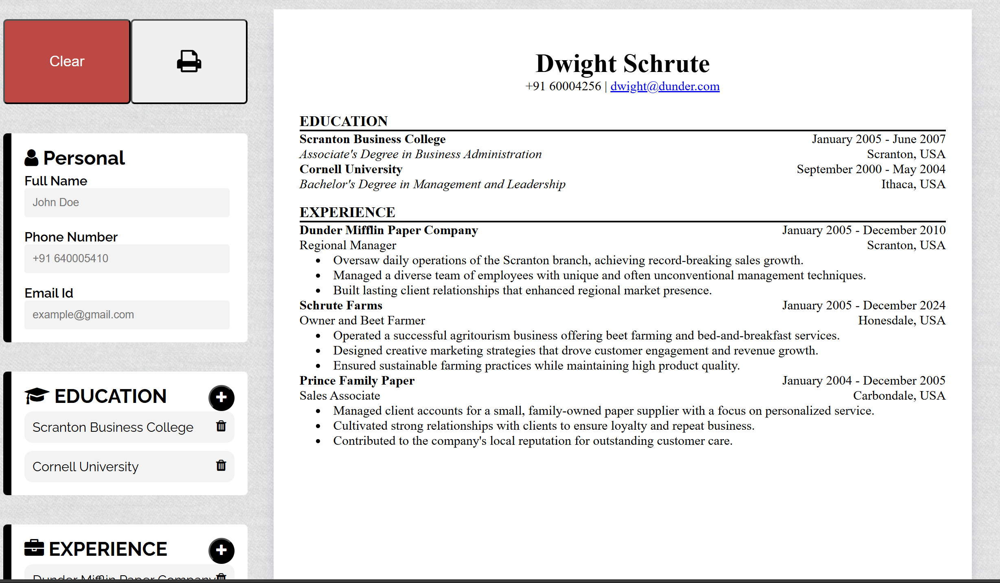

# CV Generator

This project is a **CV Generator** built using **React**, designed to help users quickly create and format their resumes. It was developed as part of **The Odin Project**, where I explored and implemented **React states**, gaining a deeper understanding of their role in managing dynamic and interactive components. [live-demo](https://glittery-centaur-f62000.netlify.app/)


---

## Screenshots



---

## Features

- **User-friendly Interface**: Input fields for all major CV sections (Personal Details, Work Experience, Education, Skills, etc.).
- **Real-time Preview**: Changes update instantly in the preview panel.
- **Dynamic Sections**: Add or remove experiences, skills, or education entries with ease.
- **Downloadable Output**: Export the generated CV as a PDF.

---

## Technologies Used

- **React**: Front-end library for building user interfaces.
- **React Hooks**: Utilized `useState` for managing component states.
- **CSS/Styled Components**: For styling the application.

---

## What I Learned

This project was an opportunity to:

- **Understand and implement React states**: Learned how to use `useState` for handling user inputs and dynamically updating the CV preview.
- **Component-based architecture**: Designed reusable components for different sections of the CV.
- **Data flow in React**: Managed parent-child data flow and ensured seamless updates across components.
- **Styling in React**: Improved skills in using CSS modules and inline styling techniques for React.
- **Conditional Rendering**: Used conditions to dynamically render sections based on user inputs.

---

## How to Use

1. Clone this repository:
   ```bash
   git clone https://github.com/hafm919/odin-cv-app.git
   ```
2. Navigate to the project directory:
   ```bash
   cd odin-cv-app
   ```
3. Install dependencies:
   ```bash
   npm install
   ```
4. Start the development server:
   ```bash
   npm start
   ```
5. Open the application in your browser at `http://localhost:3000`.
6. Alternatively, view the live version of the application at: [Live Demo](https://your-live-link.com)

---

## Future Improvements

- **Theme Customization**: Add options for users to choose between different CV templates and color schemes.
- **Integration with APIs**: Allow importing of data from LinkedIn or other sources.
- **Drag-and-Drop Interface**: Improve section arrangement via a drag-and-drop UI.
- **Save Progress**: Enable saving CV drafts for future edits.
- **Advanced PDF Styling**: Enhance PDF export with richer formatting options.

---

## Feedback and Contributions

I’m constantly looking to improve! If you have feedback or ideas, feel free to reach out or open an issue on the GitHub repository.

---

## Acknowledgments

- The React documentation and The Odin Project for their incredible resources.
